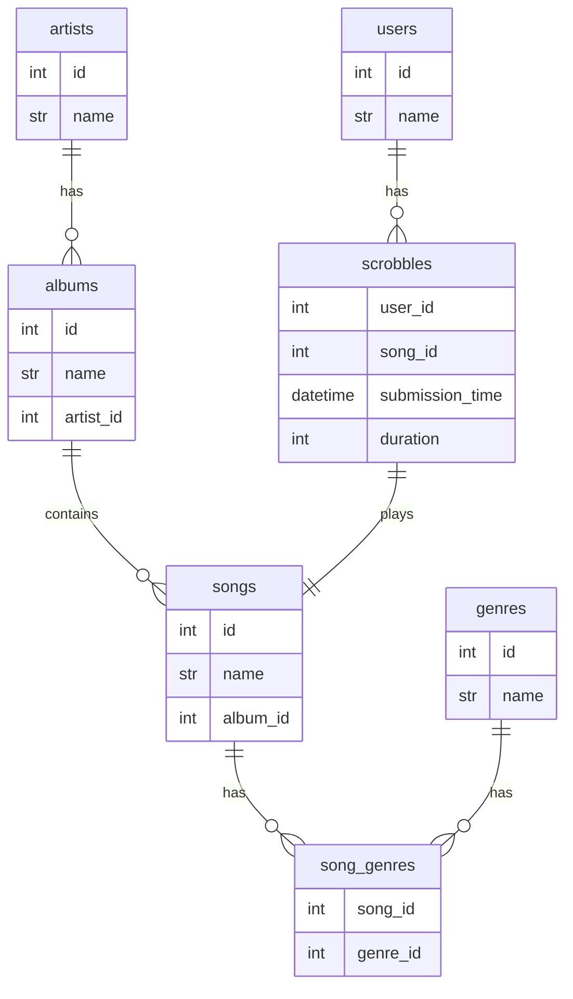

# NaviWrapped
A self-hosted year-in-review web app for music listening history.
___
## Features:
### Wrapped-Style Report
- Minutes Listened - per month and per year
- Most listened to songs/albums/artists - per month and per year
- Most listened to new song/album - per year
- Top Genres 

### Future Ideas
- Top X% Listener for top artist
- Streaks - top artist X consecutive months / longest listening streak
- Comparison to previous year

---
## Steps to build:
**1. Design the database schema**
- Data to be collected: users, artists, albums, songs, genres, scrobbles

**2. Choose the stack**
- Database - SQLite
- Backend - Go
- Frontend - React
- Hosting - Docker

**3. Implement Scrobbler**

**4. Build stats layer**

**5. Build the frontend**

---
## Database Schema
